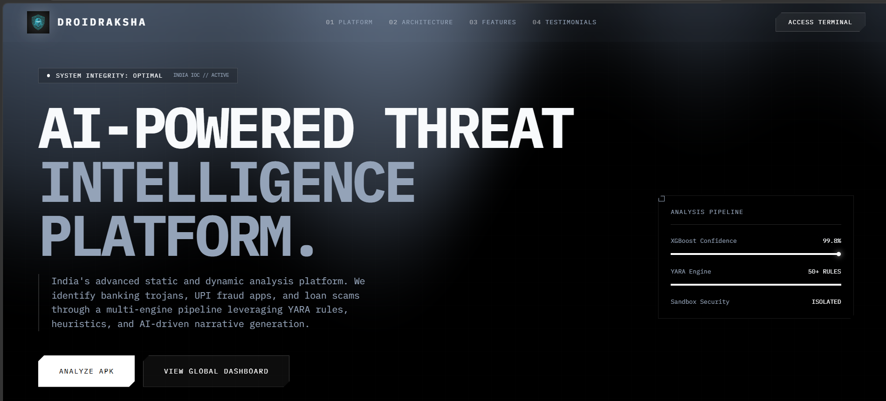
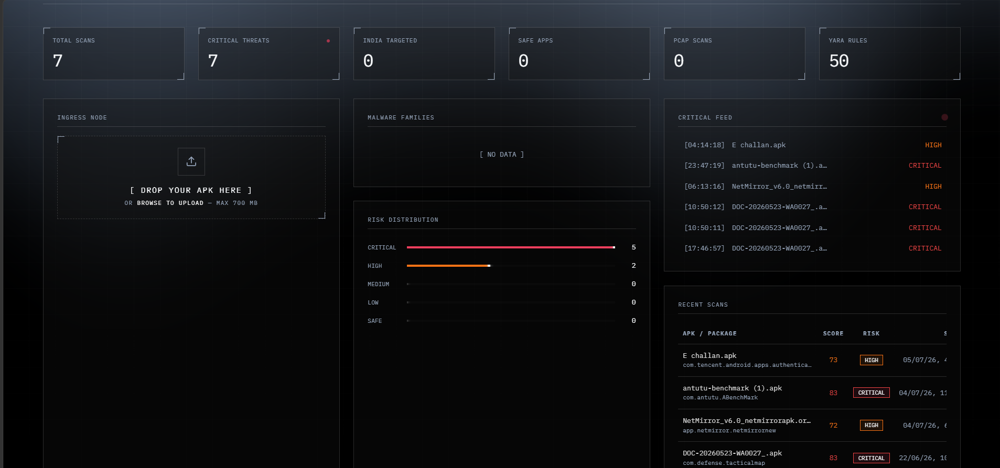
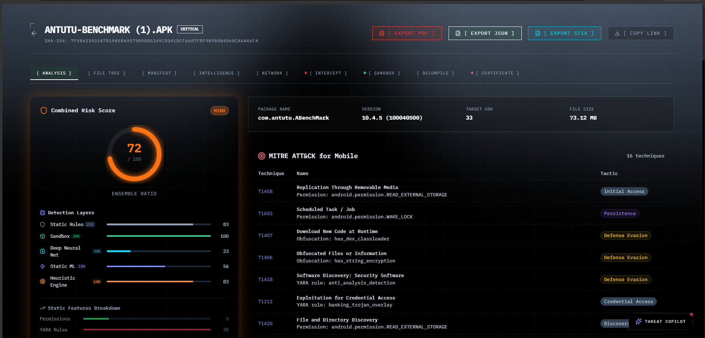
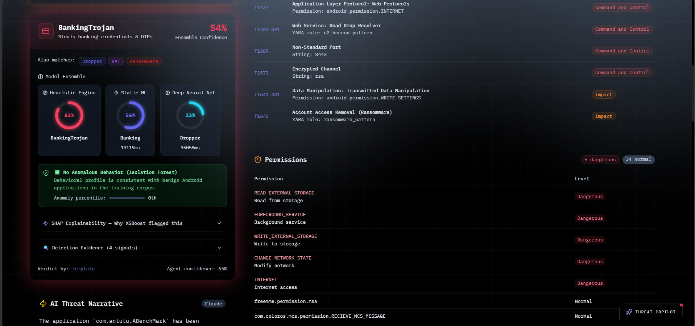
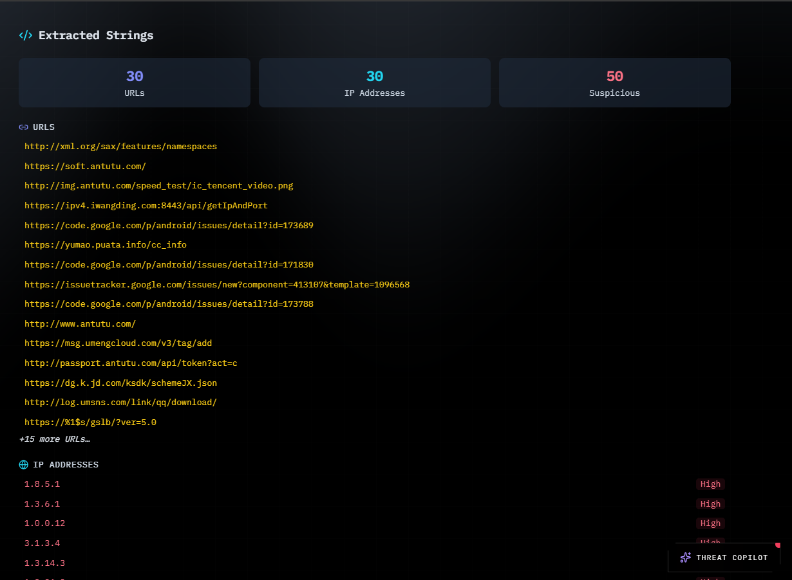
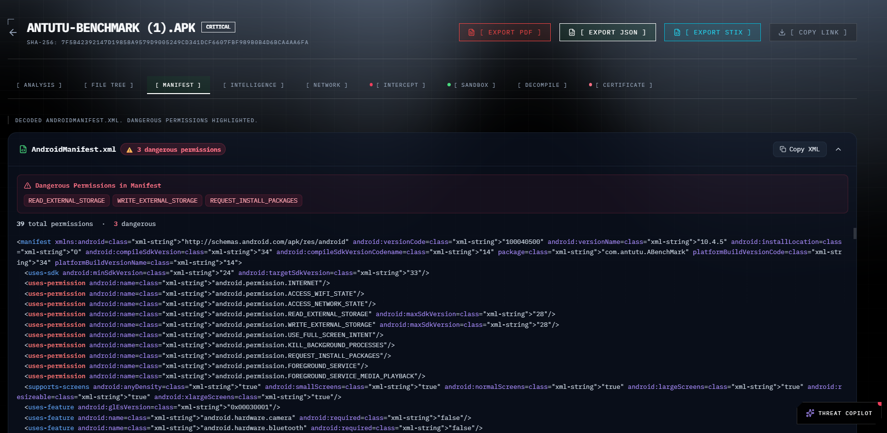
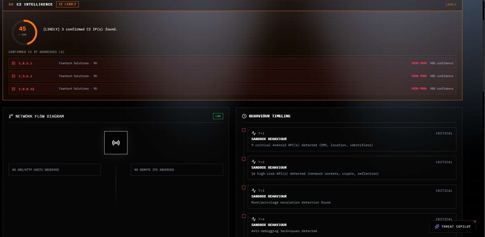
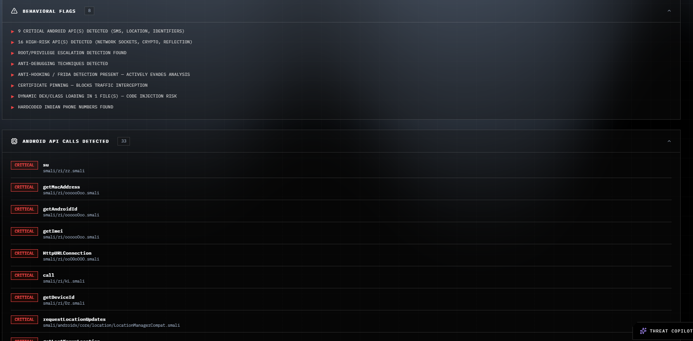
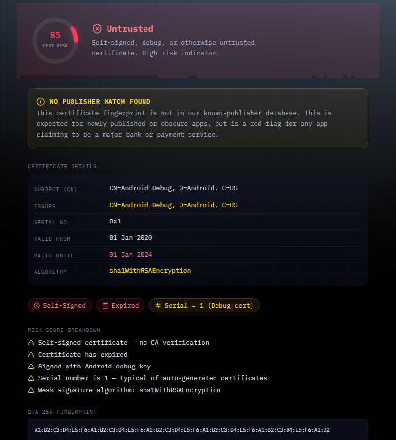

<div align="center">
  
  <h1>DroidRaksha 🛡️</h1>
</div>

**India's AI-Powered APK Threat Intelligence Platform**

DroidRaksha is an advanced, high-performance static and dynamic analysis platform designed to detect Android malware, specifically tailored for the Indian cybersecurity landscape. It identifies banking trojans, UPI fraud apps, loan scams, and other mobile threats through a multi-engine analysis pipeline, leveraging YARA rules, heuristics, Live Android Emulator Interception, and AI-driven narrative generation.

## Quick Start (Running Locally)

DroidRaksha requires a local Android emulator for advanced Live Intercept dynamic analysis.

### 1. Prerequisites
- **Docker Desktop**: Installed and running.
- **Genymotion / VirtualBox**: Install Genymotion and VirtualBox. Set up a virtual device and ensure the Genymotion emulator is running before starting an analysis.
- **ADB (Android Debug Bridge)**: Must be installed and accessible in your system's PATH.

### 2. Start the Application
Clone the repository and start the Docker environment. This single command will automatically build and spin up the complete microservices architecture, including the Next.js Frontend, FastAPI Backend, Redis Message Queue, and Celery Analysis Workers.
```bash
git clone https://github.com/praju455/DroidRaksha-.git
cd DroidRaksha-
docker compose up --build -d
```
Once the containers are running, access the Web Dashboard at `http://localhost:3000`.

### 3. Automated Emulator Intercept
DroidRaksha now features an automated endpoint that connects to your running Genymotion emulator via ADB. It automatically installs the target APK, configures proxy settings to route traffic through `mitmproxy`, and monitors live network connections (C2 communications) during the analysis session.

If the automated proxy configuration fails or needs to be set manually for `mitmproxy`, run the following ADB command:
```powershell
& "C:\Android\platform-tools\adb.exe" shell settings put global http_proxy 10.0.3.2:8080
```

*Note: The first build might take a few minutes as it downloads the machine learning models and configures the environment.*

## Architecture

DroidRaksha employs a scalable, microservices-based architecture designed for distributed threat analysis:

```mermaid
graph TD
    subgraph Clients ["Clients & Gateway"]
        UI[Next.js 14 Web Dashboard]
        Mobile[React Native Android App]
        Nginx[Nginx Reverse Proxy & Load Balancer]
        UI -->|HTTPS / WSS| Nginx
        Mobile -->|HTTPS| Nginx
    end

    subgraph Orchestration ["Backend & Orchestration"]
        FastAPI[FastAPI Gateway]
        RedisQueue[(Redis Cache & Queue)]
        Celery[Celery Workers]
        Nginx -->|REST / WebSocket| FastAPI
        FastAPI -->|Enqueue Jobs| RedisQueue
        RedisQueue --> Celery
    end

    subgraph Static ["1. Static Analysis Layer"]
        Androguard[Androguard & APKTool]
        Manifest[Manifest Parser]
        Strings[String Extractor]
        YARA[YARA Engine 50+ Rules]
        Cert[Certificate Analyzer]
        Obfuscation[Obfuscation & Heuristics]
        Mitre[MITRE ATT&CK Mapper]
        Celery --> Androguard
        Celery --> Manifest
        Celery --> Strings
        Celery --> YARA
        Celery --> Cert
        Celery --> Obfuscation
        Celery --> Mitre
    end

    subgraph StaticML ["2. Static ML Layer"]
        XGBoost[XGBoost Classifier]
        SHAP[SHAP Explainability]
        MalBERT[MalBERT Zero-shot]
        IsolationForest[Isolation Forest]
        LangChain[LangChain Agent]
        ExtIntel[VT / AbuseIPDB / India IOC]
        Celery --> XGBoost
        XGBoost --> SHAP
        Celery --> MalBERT
        Celery --> IsolationForest
        Celery --> LangChain
        Celery --> ExtIntel
    end

    subgraph Dynamic ["3. Dynamic Analysis Layer"]
        Emulator[Android Emulator - ADB]
        Frida[Frida Runtime Hooks]
        Mitmproxy[mitmproxy / PCAP Analyzer]
        Behavior[Network Behavior - DGA/JA3]
        Evidence[Forensic Evidence Linker]
        FastAPI -->|Automated ADB Install & Proxy| Emulator
        Emulator --> Frida
        Emulator --> Mitmproxy
        Mitmproxy --> Behavior
        Behavior --> Evidence
    end

    subgraph DataLayer ["Data Layer"]
        RDS[(AWS RDS PostgreSQL)]
        Mongo[(MongoDB Atlas)]
        Elastic[(Elasticsearch)]
        S3[(AWS S3 Storage)]
        Celery --> |Relational| RDS
        Celery --> |Raw JSON| Mongo
        Celery --> |Campaigns| Elastic
        FastAPI --> |APK & PCAP| S3
        Celery --> |Artifacts| S3
    end

    classDef client fill:#1e40af,stroke:#fff,stroke-width:2px,color:#fff;
    classDef orchestration fill:#047857,stroke:#fff,stroke-width:2px,color:#fff;
    classDef static fill:#b45309,stroke:#fff,stroke-width:2px,color:#fff;
    classDef staticml fill:#6d28d9,stroke:#fff,stroke-width:2px,color:#fff;
    classDef dynamic fill:#dc2626,stroke:#fff,stroke-width:2px,color:#fff;
    classDef data fill:#334155,stroke:#fff,stroke-width:2px,color:#fff;

    class UI,Mobile,Nginx client;
    class FastAPI,RedisQueue,Celery orchestration;
    class Androguard,Manifest,Strings,YARA,Cert,Obfuscation,Mitre static;
    class XGBoost,SHAP,MalBERT,IsolationForest,LangChain,ExtIntel staticml;
    class Emulator,Frida,Mitmproxy,Behavior,Evidence dynamic;
    class RDS,Mongo,Elastic,S3 data;
```



### Detailed Architecture Explanation

The architecture is divided into the Gateway, Orchestration, Data Layer, and the core **18-Stage Analysis Engine**, which is strictly classified into three primary intelligence layers:

#### 1. Static Analysis Layer
Extracts static features and signatures without executing the application.
*   **Androguard & APKTool:** Reverse engineering, decompiling the APK, and extracting bytecode.
*   **Manifest Parser:** Extracts permissions, dangerous combinations, services, and receivers.
*   **String Extractor:** Pulls hardcoded IPs, URLs, base64 payloads, and crypto keys.
*   **YARA Engine:** Scans extracted files against 50+ comprehensive rulesets for malicious signatures.
*   **Certificate Analyzer:** Checks publisher details, trust verdict, and generates a certificate risk score.
*   **Obfuscation & Heuristics:** Identifies packed code, hidden payloads, and suspicious static traits.
*   **MITRE ATT&CK Mapper:** Maps extracted static features directly to MITRE tactics and techniques.

#### 2. Static ML Layer (AI & Intelligence)
Leverages advanced machine learning and AI to classify threats based on static features.
*   **XGBoost Classifier:** Trained on the CICMalDroid 2020 dataset for 5-class malware detection.
*   **SHAP Explainability:** Interpretable AI output showing exact feature impact on the XGBoost score.
*   **MalBERT:** HuggingFace BART zero-shot text classification applied on manifest and rules.
*   **Isolation Forest:** Zero-day anomaly detection engine for novel, unseen mobile threats.
*   **LangChain ReAct Agent (Gemini Flash):** Autonomous agent synthesizing evidence into court-admissible verdicts.
*   **External Threat Intel (VT / AbuseIPDB / OTX):** Enriches static indicators using external API sources.
*   **India IOC DB:** A curated database of Indicators of Compromise targeting the Indian landscape.

#### 3. Dynamic Analysis Layer
Executes the APK in a secure environment to capture live runtime and network behavior.
*   **Android Emulator Automation:** The backend automatically connects via ADB, installs the APK, and configures proxies on-the-fly.
*   **Frida Runtime Hooks:** Hooks into the running application to trace API calls, file I/O, and cryptographic operations.
*   **mitmproxy:** Intercepts live SSL/HTTP traffic and captures full network flows.
*   **PCAP Analyzer (tcpdump):** Extracts and analyzes DNS requests, HTTP flows, and TLS-SNI information.
*   **Network Behavior Analyzer:** Identifies Domain Generation Algorithms (DGA), malicious TLS fingerprints (JA3), and C2 beaconing.
*   **Forensic Evidence Linker:** Automatically correlates static hardcoded IPs with live dynamic C2 IPs to provide definitive proof.

## Tech Stack & Features

### Core Analysis & Sandbox Engines
- **Static Analysis:** Androguard, APKTool, and an extensive YARA engine.
- **Dynamic Analysis:** Live Genymotion Emulator integration via ADB, `mitmproxy` for intercepting SSL/HTTP traffic, and PCAP extraction.
- **Forensic-Grade Evidence Linking:** Automatically correlates static indicators (e.g., hardcoded IPs in code) with live network activity to provide definitive proof of malicious behavior.

### Threat Intelligence & AI
- **Ensemble Risk Scoring:** Calculates a weighted risk score by combining Static Rules, Sandbox analysis, Deep Neural Nets, Static ML, and Heuristic Engines.
- **Machine Learning Models:**
  - **XGBoost Classifier:** Trained on the CICMalDroid dataset.
  - **MalBERT:** Zero-shot text classification on manifest and rules.
- **Autonomous AI Agent:** LangChain ReAct agent synthesizing evidence into readable verdicts.

## Folder Structure

```text
DroidRaksha/
├── backend/
│   ├── ai/               ← Machine Learning and LLM Agents (XGBoost, MalBERT, LangChain)
│   ├── db/               ← Database configurations
│   ├── engines/          ← Static and Dynamic analysis engines (YARA, PCAP, etc.)
│   ├── intel/            ← External Threat Intel Integrations (VT, AbuseIPDB, India IOC)
│   ├── routes/           ← FastAPI endpoints (Upload, Report, WebSocket, Emulator Integration)
│   ├── scoring/          ← Ensemble Risk Scorer
│   └── worker/           ← Celery tasks for distributed processing
├── frontend/
│   ├── app/              ← Next.js App Router (Dashboard, Results page)
│   ├── components/       ← React Components (RiskScoreCard, LiveInterceptPanel, etc.)
│   └── lib/              ← API utilities and Types
├── models/               ← Pre-trained ML models and scalers
├── rules/                ← Custom YARA rulesets
└── scripts/              ← Training and utility scripts
```

## Screenshots

<div align="center">
  
  
  
  
  
  
  
  
  
</div>

