<div align="center">
  
  <h1>DroidRaksha 🛡️</h1>
</div>

**India's AI-Powered APK Threat Intelligence Platform**

DroidRaksha is an advanced, high-performance static and dynamic analysis platform designed to detect Android malware, specifically tailored for the Indian cybersecurity landscape. It identifies banking trojans, UPI fraud apps, loan scams, and other mobile threats through a multi-engine analysis pipeline, leveraging YARA rules, heuristics, Live Android Emulator Interception, and AI-driven narrative generation.

## Quick Start (Running Locally)

DroidRaksha requires a local Android emulator for advanced Live Intercept dynamic analysis.

### 1. Prerequisites
- **Docker Desktop**: Installed and running.
- **Genymotion / VirtualBox**: Install Genymotion and VirtualBox. Set up a virtual device and ensure the Genymotion emulator is running before starting an analysis.
- **ADB (Android Debug Bridge)**: Must be installed and accessible in your system's PATH.

### 2. Start the Application
Clone the repository and start the Docker environment. This single command will automatically build and spin up the complete microservices architecture, including the Next.js Frontend, FastAPI Backend, Redis Message Queue, and Celery Analysis Workers.
```bash
git clone https://github.com/praju455/DroidRaksha-.git
cd DroidRaksha-
docker compose up --build -d
```
Once the containers are running, access the Web Dashboard at `http://localhost:3000`.

### 3. Automated Emulator Intercept
DroidRaksha now features an automated endpoint that connects to your running Genymotion emulator via ADB. It automatically installs the target APK, configures proxy settings to route traffic through `mitmproxy`, and monitors live network connections (C2 communications) during the analysis session.

If the automated proxy configuration fails or needs to be set manually for `mitmproxy`, run the following ADB command:
```powershell
& "C:\Android\platform-tools\adb.exe" shell settings put global http_proxy 10.0.3.2:8080
```

*Note: The first build might take a few minutes as it downloads the machine learning models and configures the environment.*

## Architecture

DroidRaksha employs a scalable, microservices-based architecture designed for distributed threat analysis:

```mermaid
graph TD
    subgraph Clients ["Clients & Gateway"]
        UI[Next.js 14 Web Dashboard]
        Mobile[React Native Android App]
        Nginx[Nginx Reverse Proxy & Load Balancer]
        UI -->|HTTPS / WSS| Nginx
        Mobile -->|HTTPS| Nginx
    end

    subgraph Orchestration ["Backend & Orchestration"]
        FastAPI[FastAPI Gateway]
        RedisQueue[(Redis Cache & Queue)]
        Celery[Celery Workers]
        Nginx -->|REST / WebSocket| FastAPI
        FastAPI -->|Enqueue Jobs| RedisQueue
        RedisQueue --> Celery
    end

    subgraph Static ["1. Static Analysis Layer"]
        Androguard[Androguard & APKTool]
        Manifest[Manifest Parser]
        Strings[String Extractor]
        YARA[YARA Engine 50+ Rules]
        Cert[Certificate Analyzer]
        Obfuscation[Obfuscation & Heuristics]
        Mitre[MITRE ATT&CK Mapper]
        Celery --> Androguard
        Celery --> Manifest
        Celery --> Strings
        Celery --> YARA
        Celery --> Cert
        Celery --> Obfuscation
        Celery --> Mitre
    end

    subgraph StaticML ["2. Static ML Layer"]
        XGBoost[XGBoost Classifier]
        SHAP[SHAP Explainability]
        MalBERT[MalBERT Zero-shot]
        IsolationForest[Isolation Forest]
        LangChain[LangChain Agent]
        ExtIntel[VT / AbuseIPDB / India IOC]
        Celery --> XGBoost
        XGBoost --> SHAP
        Celery --> MalBERT
        Celery --> IsolationForest
        Celery --> LangChain
        Celery --> ExtIntel
    end

    subgraph Dynamic ["3. Dynamic Analysis Layer"]
        Emulator[Android Emulator - ADB]
        Frida[Frida Runtime Hooks]
        Mitmproxy[mitmproxy / PCAP Analyzer]
        Behavior[Network Behavior - DGA/JA3]
        Evidence[Forensic Evidence Linker]
        FastAPI -->|Automated ADB Install & Proxy| Emulator
        Emulator --> Frida
        Emulator --> Mitmproxy
        Mitmproxy --> Behavior
        Behavior --> Evidence
    end

    subgraph DataLayer ["Data Layer"]
        RDS[(AWS RDS PostgreSQL)]
        Mongo[(MongoDB Atlas)]
        Elastic[(Elasticsearch)]
        S3[(AWS S3 Storage)]
        Celery --> |Relational| RDS
        Celery --> |Raw JSON| Mongo
        Celery --> |Campaigns| Elastic
        FastAPI --> |APK & PCAP| S3
        Celery --> |Artifacts| S3
    end

    classDef client fill:#1e40af,stroke:#fff,stroke-width:2px,color:#fff;
    classDef orchestration fill:#047857,stroke:#fff,stroke-width:2px,color:#fff;
    classDef static fill:#b45309,stroke:#fff,stroke-width:2px,color:#fff;
    classDef staticml fill:#6d28d9,stroke:#fff,stroke-width:2px,color:#fff;
    classDef dynamic fill:#dc2626,stroke:#fff,stroke-width:2px,color:#fff;
    classDef data fill:#334155,stroke:#fff,stroke-width:2px,color:#fff;

    class UI,Mobile,Nginx client;
    class FastAPI,RedisQueue,Celery orchestration;
    class Androguard,Manifest,Strings,YARA,Cert,Obfuscation,Mitre static;
    class XGBoost,SHAP,MalBERT,IsolationForest,LangChain,ExtIntel staticml;
    class Emulator,Frida,Mitmproxy,Behavior,Evidence dynamic;
    class RDS,Mongo,Elastic,S3 data;
```



### Detailed Architecture Explanation: The 18-Stage Analysis Engine

The core architecture revolves around our **18-Stage Analysis Engine**, meticulously divided across three intelligence layers. Below is the complete breakdown of every engine, its purpose, and where it lives in the codebase.

#### 1. Static Analysis Layer (7 Engines)
This layer extracts features, metadata, and malicious signatures directly from the APK binary without executing it.

*   **1. Androguard & APKTool Engine**
    *   **Purpose:** The foundational reverse-engineering engine. It decompiles the APK, extracts the raw Dalvik bytecode (Smali), and parses the structural components.
    *   **Location:** `backend/engines/static_analyzer.py` & `backend/engines/jadx_decompiler.py`
*   **2. Manifest Parser**
    *   **Purpose:** Analyzes the `AndroidManifest.xml` to extract requested permissions, exported services, and broadcast receivers. It flags inherently dangerous permission combinations (e.g., `READ_SMS` + `SEND_SMS`).
    *   **Location:** `backend/engines/manifest_parser.py`
*   **3. String Extractor**
    *   **Purpose:** Scrapes the decompiled code for hardcoded artifacts. It uses regex to identify IPv4/IPv6 addresses, URLs, email addresses, base64 encoded payloads, and cryptographic keys.
    *   **Location:** `backend/engines/string_extractor.py`
*   **4. YARA Scanner Engine**
    *   **Purpose:** A signature-matching engine that scans the extracted files against a database of 50+ comprehensive custom rulesets to detect known malware families and patterns.
    *   **Location:** `backend/engines/yara_scanner.py` (Rules in `rules/`)
*   **5. Certificate & Signature Analyzer**
    *   **Purpose:** Inspects the app's signing certificate. It checks the issuer, validity period, and generates a certificate risk score to catch forged or untrusted developers.
    *   **Location:** `backend/engines/cert_analyzer.py`
*   **6. Obfuscation & Heuristics Engine**
    *   **Purpose:** Detects defensive evasion techniques. It identifies packed code (e.g., UPX, DexGuard), hidden payloads, and suspicious static traits designed to bypass AV.
    *   **Location:** `backend/engines/obfuscation.py`
*   **7. MITRE ATT&CK Mapper**
    *   **Purpose:** Translates all discovered static features and heuristics into standardized MITRE ATT&CK Mobile tactics and techniques for standardized reporting.
    *   **Location:** `backend/ai/mitre_full.py`

#### 2. Static ML Layer (AI & Intelligence) (7 Engines)
This layer leverages advanced machine learning, Natural Language Processing (NLP), and AI to classify threats based on the static features.

*   **8. XGBoost Classifier**
    *   **Purpose:** A high-performance gradient boosted tree model trained on the CICMalDroid 2020 dataset. It classifies the app into 5 distinct malware categories.
    *   **Location:** `backend/ai/xgboost_classifier.py`
*   **9. SHAP Explainability Engine**
    *   **Purpose:** Provides transparency to the XGBoost model. It outputs exactly which features (e.g., specific permissions or API calls) contributed most to the risk score.
    *   **Location:** Integrated within `backend/ai/xgboost_classifier.py`
*   **10. MalBERT (Zero-shot NLP)**
    *   **Purpose:** Utilizes a HuggingFace BART zero-shot text classification model. It reads the manifest and YARA rule descriptions like a human to infer malicious intent.
    *   **Location:** `backend/ai/malbert_classifier.py`
*   **11. Isolation Forest (Anomaly Detection)**
    *   **Purpose:** An unsupervised learning engine designed to detect zero-day anomalies. It identifies apps that deviate significantly from known benign baselines.
    *   **Location:** `backend/ai/anomaly_detector.py`
*   **12. LangChain ReAct Agent (Gemini Flash)**
    *   **Purpose:** An autonomous AI agent that ingests the raw outputs from all other engines and synthesizes a highly readable, court-admissible forensic narrative.
    *   **Location:** `backend/ai/langchain_agent.py` & `backend/ai/narrative.py`
*   **13. External Threat Intel Integrations**
    *   **Purpose:** Enriches static indicators (IPs/Hashes) by querying external APIs (VirusTotal, AbuseIPDB, AlienVault OTX) for global threat reputation.
    *   **Location:** `backend/intel/virustotal.py`, `backend/intel/abuseipdb.py`, `backend/intel/otx.py`
*   **14. India IOC Database**
    *   **Purpose:** A localized threat intelligence engine that checks indicators against a curated database of IOCs specifically targeting the Indian landscape.
    *   **Location:** `backend/intel/india_ioc.py`

#### 3. Dynamic Analysis Layer (Live Intercept) (4 Engines)
Executes the APK in a secure sandbox to capture real-time runtime and network behavior.

*   **15. Emulator Automation & Sandbox Engine**
    *   **Purpose:** Orchestrates the dynamic analysis environment. Connects to the emulator via ADB, installs the APK, configures proxies on-the-fly, and launches the app.
    *   **Location:** `backend/engines/sandbox_engine.py`
*   **16. Frida Runtime Hooks**
    *   **Purpose:** Injects into the running application process to dynamically trace sensitive API calls, file I/O operations, and cryptographic routines in real-time.
    *   **Location:** `sandbox/frida_hooks/api_monitor.js`
*   **17. mitmproxy & PCAP Analyzer**
    *   **Purpose:** Intercepts live SSL/HTTP traffic and captures full network flows. It extracts DNS requests, HTTP payloads, and TLS-SNI information.
    *   **Location:** `backend/engines/intercept_engine.py` & `backend/engines/pcap_analyzer.py`
*   **18. Network Behavior & Correlation Engine**
    *   **Purpose:** The final forensic evidence linker. It detects DGA domains, malicious TLS fingerprints (JA3), beaconing, and correlates static hardcoded IPs with live dynamic C2 IPs.
    *   **Location:** `backend/engines/dga_detector.py`, `backend/engines/beacon_detector.py`, & `backend/engines/correlation_engine.py`

## Tech Stack & Features

### Core Analysis & Sandbox Engines
- **Static Analysis:** Androguard, APKTool, and an extensive YARA engine.
- **Dynamic Analysis:** Live Genymotion Emulator integration via ADB, `mitmproxy` for intercepting SSL/HTTP traffic, and PCAP extraction.
- **Forensic-Grade Evidence Linking:** Automatically correlates static indicators (e.g., hardcoded IPs in code) with live network activity to provide definitive proof of malicious behavior.

### Threat Intelligence & AI
- **Ensemble Risk Scoring:** Calculates a weighted risk score by combining Static Rules, Sandbox analysis, Deep Neural Nets, Static ML, and Heuristic Engines.
- **Machine Learning Models:**
  - **XGBoost Classifier:** Trained on the CICMalDroid dataset.
  - **MalBERT:** Zero-shot text classification on manifest and rules.
- **Autonomous AI Agent:** LangChain ReAct agent synthesizing evidence into readable verdicts.

## Folder Structure

```text
DroidRaksha/
├── backend/
│   ├── ai/               ← Machine Learning and LLM Agents (XGBoost, MalBERT, LangChain)
│   ├── db/               ← Database configurations
│   ├── engines/          ← Static and Dynamic analysis engines (YARA, PCAP, etc.)
│   ├── intel/            ← External Threat Intel Integrations (VT, AbuseIPDB, India IOC)
│   ├── routes/           ← FastAPI endpoints (Upload, Report, WebSocket, Emulator Integration)
│   ├── scoring/          ← Ensemble Risk Scorer
│   └── worker/           ← Celery tasks for distributed processing
├── frontend/
│   ├── app/              ← Next.js App Router (Dashboard, Results page)
│   ├── components/       ← React Components (RiskScoreCard, LiveInterceptPanel, etc.)
│   └── lib/              ← API utilities and Types
├── models/               ← Pre-trained ML models and scalers
├── rules/                ← Custom YARA rulesets
└── scripts/              ← Training and utility scripts
```

## Screenshots

<div align="center">
  
  
  
  
  
  
  
  
  
</div>

